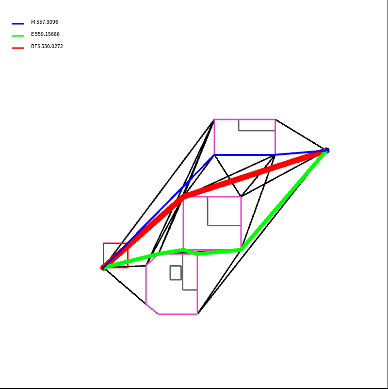
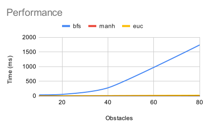
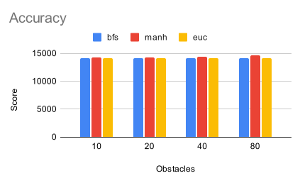

# Final Project Documentation

--- 
## Overview

A demo project that demonstrates application of computational geometry in robot path planning.

### Usage

Open the code in processing. Here are some key mappings: 

| Key | Func    |
| --  | ------  | 
| g   | generate random obstacle course |
| s   | solve using all three graph algorithm |
| t   | run all benchmark tests |
--- 
## Background 

Path planning is an area focus on how Robot/Computer can move in physical space from A to B. 
It is a subarea of Motion planning. In the literature, though there are numerous approach to this problem 
such as, physics model, probablity, control theory, and ML, geometrical approach is still popular and effective.
In this project, I will outline and implement few essential concepts in Path planning using geometry approach. 

### Visibility Map

A visibility map is a graph representing valid path that a robot can take. 
This project implements brute force way of computing the visibility map $O(n^3)$.
It utilizes Line-intersection methods we have previously implemented in the class to detect 
valid edges. Though it might seems trivial, there are quite a few technical challenges. For example,
robot has a physical body, how to incorporate this to generate correct map.

### Convex Hull

In order to correctly represent physical body of the robot, we enlarge the obstacles 
in our geomoetry space by adding corresponding points of the robot body and apply convex hull 
algorithm to obtain the enlarged obstacles. Note that we need to take extra when we apply this method, 
as the obstacles might collide into each other after enlargement. We need to carefully merge them so we can 
generate the correct graph.

### Graph Algorithm

This project explores 3 different graph search algorithms. 

- Dijkstra algorithm (Best first search)
- Astar algorithm using Manhattan distance
- Astar algorithm using Euclidean distance

I am not going to dive into details of how those works. However, it is worth noting that BSF uses recursive/dp
to generate optimal solution (shortest distance) while Astar uses heuristics to greedily choose path (thus 
it doesn't gurantee optimal solution).  

--- 
## Benchmark/Result

### analysis

In this project, I implemented a suboptimal BFS, which is $O(n^2)$. In theory, this can be as low as
$O(nlog(n))$ through usage of a priority queue. As for the Astar algorithm, those algorithm run-time can
vary. In the worst case, they should run $O(n^2)$. However, in practice, they should have linear behavior.
Note that, this performance boost does come with a cost of not yielding optimal solution. 

### data

All data is generate with 50 iteration. 

Performance table. Note: time is in (ms). 
|Objects|	bfs |	manh|	euc|
|------ |---- | ----| ---|
|10	    | 31	| 0	  | 0  |
|20	    | 49	| 1	  | 2  |
|40	    | 272	| 3	  | 5  |
|80	    | 1737|	9	  | 20 |

Accuracy Table. Note: Lower score the better.
|Objects| bfs	    | manh    | euc    |
|------ |-------  | ------- | ------ |
|10     |	14139.4	| 14231.5	| 14143.2|
|20	    | 14139.6	| 14294.6	| 14145.1|
|40	    | 14139.7	| 14379	  | 14153.1|
|80	    | 14167.4	| 14568.8	| 14167.4|

### discussion

Surprisingly, by not yielding optimal path, we can improve performance drastically. 
However, Astar algorithm should be used with caution as it could produce results that is 
much more suboptimal. 

--- 
Author: Jerry Zhang

